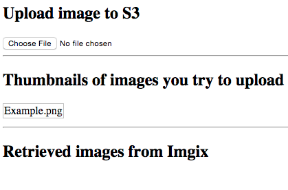

## Problem

How to make a user direct upload an image to a server that is nicely displayed
on any devices?

## Solution conditions

- User should upload one copy of each of his images he wants to publish, directly
to some server.

- The upload should be authorized: only this user should upload to this link
provided he verified some conditions.
    - e.g: a user should not upload too much images.

- Any other users accessing the image should download what it needs, no more, no
  less.
    - e.g: 100x100 CSS pixel image represents 10kb if `window.devicePixelRatio
      === 1` and viewport is set; 40kb if `window.devicePixelRatio === 2`.

- User requesting an appropriate derived image ⇒ eats some resources processing
  the source image. So, requests should be `authorized` to avoid "bad players".
    - e.g: request should not be changed "mid-air".

## Proof of concept: S3 & Imgix

From a meteor app, upload an image to S3, download device specific derived image from imgix.

## How to run it

(Please, modify the code as much as you need and share improvements.)

- Create an S3 and Imgix account, so that you can fill up the `settings.json`
  file that matches the `settings.template.json` file template.
    - Some sample AWS policies and CORS rules are in the repo.
        - One "imageAdmin" user played by your server
        - One "imageUser" played by your users
    - Make sure that you don't push your `settings.json` file to the world with
      your `.gitignore`.
    - Read the [Imgix](https://www.imgix.com/) doc on how to hook the S3 bucket
      with the Imgix service.

- Run the app: `$ meteor --settings settings.json`, `localhost:3000` should show
you this simple page:

## How to use it

A table in the `upload-images.js` comments should guide you in the code:
- `def` column gives you markers to see where are implementations of the names
  defined in other columns.
- The `Client.API` cell gives you what should be the public names of this code,
  what internals are used, where they are defined, what do they do.
- `Inputs` line gives you what should be provided for the app the work.
- `Invariants` line gives you properties that the app tries to maintain while
  executing.
- `Internals` gives you the plumbing.

## Next

- Please, share any improvements or defects you find.
- I should derived some work from this proof of concept.  Will share what needs
  to be.

## Resources

- [slingshot](https://github.com/CulturalMe/meteor-slingshot) a package that
  boxes more or less what is in here.
- [Heroku Dec Center](https://devcenter.heroku.com/articles/s3-upload-node) some
  directions for setting up S3 Buckets.
- The funny ":≡" symbol is a shortcut. Instead of writing: "From now on,
  wherever you see X, you can mentally replace it by the string XXXYYYZZZ", is
  written: "X :≡ XXXYYYZZZ".
